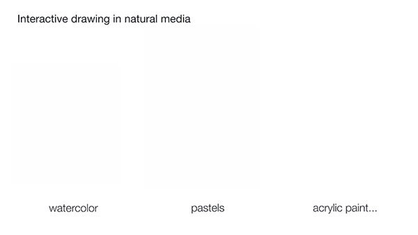
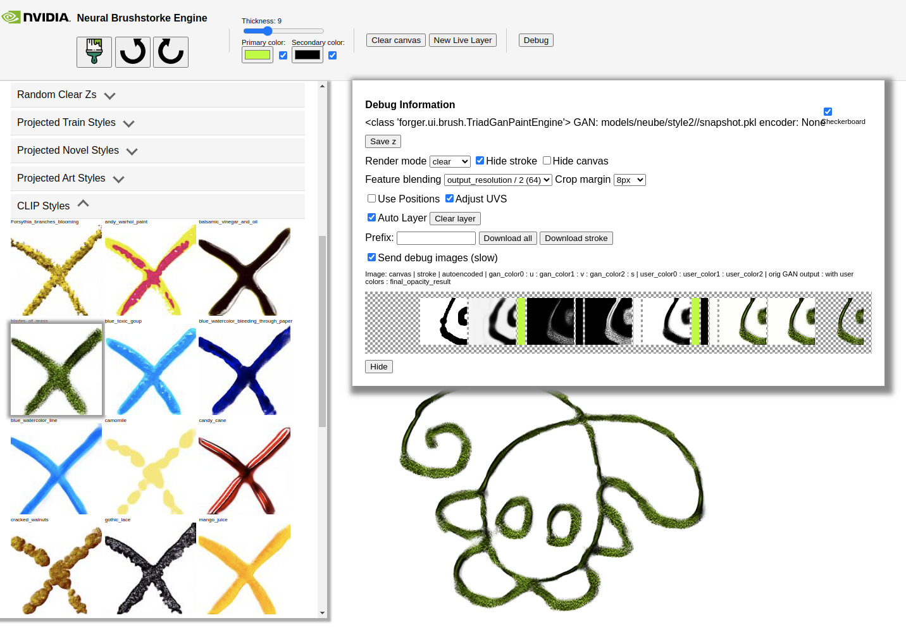
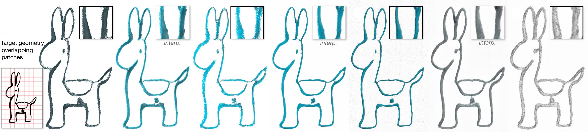

# Neural Brushstroke Engine

This is the official repository for "Neural Brushstroke Engine: Learning a Latent Style Space of
Interactive Drawing Tools" by Masha Shugrina, Chin-Ying Li and Sanja Fidler. SIGGRAPH Asia 2022.
[See Official Project Website](https://nv-tlabs.github.io/brushstroke_engine/).

<p align="center">

</p>

Neural Brushstroke Engine (NeuBE) includes a GAN model that learns to mimic many drawing media styles
by learning from unlabeled images. The result is a GAN model that can be
directly controlled by user strokes, with style code **z** corresponding to the style of the interactive brush (and not the final image). Together
with a patch-based paining engine, NeuBE allows seamless drawing on a canvas of
any size, user control of stroke color, compositing of strokes on clear background,
and text-based brush search. NeuBE generalizes very well to unseen styles and requires only
about 200 images of different drawing media to train. We also support automatic stylization of line drawings. Try out our drawing interface!


## Requirements

You will need a CUDA-enabled version of PyTorch in your environment. This model comfortably runs on a 12GB GPU,
and might be able to work with less. Training and other scripts may require more memory. We have only run this code on linux systems, but in principle other CUDA-enabled setups should work.

If using a local environment such as [anaconda](https://docs.conda.io/projects/conda/en/latest/user-guide/tasks/manage-environments.html), create the environment and install PyTorch (we used torch 1.7 and 1.8),
then install requirements. For example, assuming your system supports CUDA 11.1:

```shell
conda create --name art_forger python=3.7
conda activate art_forger
pip install torch==1.8.1+cu111 torchvision==0.9.1+cu111 -f https://download.pytorch.org/whl/torch_stable.html
pip install -r requirements.txt
pip install -e .
```

We additionally provide a Docker file.


## Datasets and Models

Pretrained models are available in [models.zip](https://nvidia-caat.s3.us-east-2.amazonaws.com/neube/models.zip) (backup link [here](https://drive.google.com/file/d/1OU7cEVeALBVaqDabj4uBQ1xJ8NrdOAI4/view?usp=sharing)). To setup downloaded models
run the following from the **root of this repo**:
```shell
unzip ~/Downloads/models.zip -d .
```
The data is available for download, including raw and processed files.
See [Project Website](https://nv-tlabs.github.io/brushstroke_engine/) for training dataset details. 

If using this data, code or models please make sure to cite this work.

## Drawing Interface

To launch web UI using unzipped checkpoints run the following, and go to [localhost:8000/?demo&canvas=2000](http://localhost:8000/?demo&canvas=2000) to draw. 

```shell
MODEL=style1  # or style2 for a model trained on less usual drawing styles
bash neube_run.sh $MODEL  # Run without model argument to get help and options
```

This command launches UI pre-loaded with a menu of brushes and a debug interface to experiment with model settings. 
The `demo` URL
parameter sets the best drawing options automatically; use `canvas` URL parameter to adjust drawing canvas size. 
We recommend Chrome browser on the desktop and Safari on iPad. 



## Line Drawing Stylization

We also provide a script to automatically stylize input line drawings given select style.

```shell
MODEL=style2  # or style1 for a model trained on more traditional styles
INPUT=forger/images/large_guidance/lamali_sm.png  # or your own black on white line drawing
STYLE=playdoh10  # tip: see log of neube_run.sh for style names
LIBRARY=models/neube/style2/brush_libs/projected_training_styles.pkl  # style lib of the right model

bash neube_stylize.sh $MODEL $INPUT $STYLE $LIBRARY  # Run without arguments to get help and options
```

Or, to stylize by a random seed used to generate **z**, run:
```shell
Z=594  # seed that deterministically sets the multi-dimensional z-vector
bash neube_stylize.sh $MODEL $INPUT $Z
```

Note that the corresponding python script `forger.viz.paint_image_main` can also produce outputs on clear background and
supports style interpolation, e.g. like this:



## Training

First download the training datasets (see above), and unpack as follows into the **root of this repo**: 

```shell
mkdir data
unzip ~/Downloads/astro_datasets.zip -d data
```
You will also need to download the pretrained autoencoder (see model downloads above), and install `awk` and `tee`
commandline utilities. 

To run **default training**, execute:
```shell
DATA_MODE=style2

# Default training run (projected duration ~2 weeks). 
bash neube_train.sh $DATA_MODE train /my/output/dir  # Run without arguments to get help and options

# Fintunine obtained checkpoint to improve background clarity (~1 day)
bash neube_train.sh $DATA_MODE finetune /my/output/dir \
  '--resume=/my/output/dir/neube_exp/00000-default_train-.../network-snapshot-010000.pkl'

# Run UI with test checkpoint and go to localhost:8000/?demo&canvas=2000 in your browser
python -m forger.ui.run --port=8000 \
  --gan_checkpoint=/my/output/dir/neube_exp/00001-default_finetune-.../network-snapshot-warmstarted.pkl
```

You can also provide custom arguments to the train commands. For example, you can provide `--wandb_group=test --wandb_project=neube`
to log to [WandB](https://wandb.ai/). 

To run a **really short test training run to make sure things work**, provide your
own `--kimg` (thousands of training images seen by model) flag and `--snap` (how often to save model snapshots, evaluate
and save visualizations) flags. E.g.:
``` shell
# Train (short test run)
bash neube_train.sh styles2 train /tmp/forger_train "--kimg=2 --geom_warmstart_kimg=1 --snap=1"

# Finetune (short test run)
bash neube_train.sh styles2 finetune /tmp/forger_train \
   "--geom_warmstart_kimg=1 --snap=1 --resume=/tmp/forger_train/neube_exp/00000-default_train-.../network-snapshot-000002.pkl"
   
# Run UI with test checkpoint and go to localhost:8000/?demo&canvas=2000 in your browser
python -m forger.ui.run --port=8000 \
        --gan_checkpoint=/tmp/forger_train/neube_exp/00001-default_finetune-.../network-snapshot-warmstarted.pkl
```

**Note**: note that unfortunately we do not support multi-gpu training, and things will likely fail or behave unexpectedly
if you try to train with multiple GPUs.

## Visualizing Styles

We provide lots of utilities for visualizing styles available in the model in bulk in [forger/viz](forger/viz). For 
example, to render a large number of styles from a brush library, run (use `--mode=1` to visualize grids, `--mode=0` 
to visualize individual patches):

```shell
export STYLE=style2
python -m forger.viz.visualize_main \
  --gan_checkpoint=models/neube/$STYLE/snapshot.pkl \
  --style_seeds=models/neube/$STYLE/brush_libs/random5K_clarity0.9.txt \
  --num_random_colors=0 --mode=0 \
  --output_dir=models/neube/$STYLE/brush_viz/random5K_clarity0.9
```
## Brush Optimization

The script to project existing style image and its geometry into the style space is [scripts.project_main.py](scripts/project_main.py),
and like all our commands it should be run as a module:
```shell
 python -m scripts.project_main \
           --gan_checkpoint=$GAN \
           --output_dir=$OUT_DIR \
           --target_image=$T \
           --geom_image=$GEO \
           --log_level=20
```

Sample clip optimization script is included in the notebook [scripts/optimize_clip.jpynb](scripts/optimize_clip.jpynb). 
To expedite CLIP optimization we first search among pre-rendered styles, so make sure to run the visualization command
above (see Visualizing Styles) to render random styles before trying this notebook. 

## Code organization

Our training and model scripts are based on StyleGAN2, and a modified copy of [this repository](https://github.com/NVlabs/stylegan2-ada-pytorch) is copied
here. For legacy reasons some of our training scripts reside in that thirdparty location, while invoking
utilities from the core package.

* [forger](forger) - core python codebase
    * [ui](forger/ui) - web interface connecting to models
* [thirdparty](thirdparty) - core StyleGAN2 training code with some modifications

The name for the python package is inspired by heist plots on art forgery. Before painting can begin, a (human) art forger is first and foremost an expert that knows exactly how to mimic source media by looking at an artwork. Neural Brushstroke Engine is the first step toward acquiring this kind of expertise using AI to learn from unlabeled images and empower the human artist with "forged" digital brushes. 

## Citation

```
@article{shugrina2022neube,
  title={Neural Brushstroke Engine: Learning a Latent Style Space of Interactive Drawing Tools},
  author={Shugrina, Maria and Li, Chin-Ying and Fidler, Sanja},
  journal={ACM Transactions on Graphics (TOG)},
  volume={41},
  number={6},
  year={2022},
  publisher={ACM New York, NY, USA}
}
```